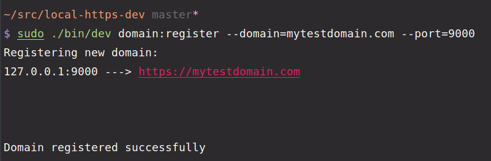
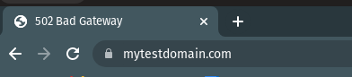
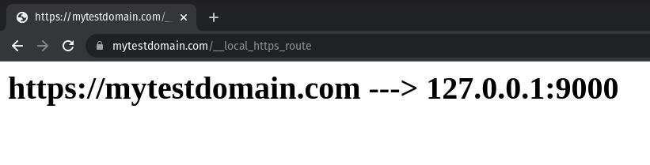

certme
=================

A CLI used to create a local https dev environment with the green lock. Setup takes less than 5 minutes and all of your projects will be running locally over HTTPS with custom domain names in no time!


[](https://oclif.io)
[](https://npmjs.org/package/certme)
[](https://npmjs.org/package/certme)
[](https://github.com/Kerren-Entrostat/certme/blob/master/package.json)

<!-- toc -->
* [Introduction](#introduction)
* [OR](#or)
* [Roadmap](#roadmap)
* [Usage](#usage)
* [Commands](#commands)
<!-- tocstop -->

# Introduction

So you have a lot of projects running locally. To get to them, you visit `http://localhost:8080`. If you want HTTPS, you always get that "warning" window from your browser saying it's not safe. What's worse is that each system has different seeded users, now you need to remember the username and passwords for each one because your browser can't tell the difference between `http://localhost:3000` and `http://localhost:9000`.

This CLI is the answer to all of your problems. It allows you to set up custom development domains and routes them to the correct port on your local machine. You can set `https://mydev.local` to point to `http://localhost:8080` and your browser will trust the certificate!

## Dependencies
I've decided that I don't really want to do all of the work, no need to reinvent the wheel. So there are a few things you need installed on your PC before starting here:

 - [nginx](https://www.nginx.com/)
 - [mkcert](http://mkcert.dev/)

These two tools are used to generate the cert, use the cert and route traffic to the correct port.

I suggest you ensure that `nginx` is always running on system startup after you install it by using the following command:

```bash
sudo systemctl enable nginx
```

## Getting Started
Getting started is pretty easy! If you have `nginx` and `mkcert` installed, then you just need to install the CLI. You can pull the `.deb` file from the latest releases and then install it using `gdebi` or `dpkg`:

```bash
sudo gdebi -i certme.deb
# OR
sudo dpkg -i certme.deb
```

Once the CLI is installed, you need to register your system username (the certificates are generated locally) and then start adding your domains.

And example of the commands would be as follows, you'll notice that it must be run as `sudo` since it edits the `/etc/hosts` file and creates an `nginx` config file. 

```bash
sudo certme user:register $(whoami)
sudo certme domain:register --domain=mytestdomain.com --port=9000
```

The user is the name of the account that you're logged into because we need to register the certificate authority and trust it under your account. This will then ensure that your browser picks it up!

And that should be it! Visit [https://mytestdomain.com](https://mytestdomain.com) and you should see the green lock!



Now if you visit the domain:




## Extra Functionality

There are a few extra features I've added to the project to improve the UX.

### Autocompletion

You can add the autocompletion to one of your favourite shells. Just run,

```bash
certme autocomplete
```

And follow the instructions to add it to your shell.

### Route Check

If you want to see which port the custom domain you created is going to, you can use the endpoint: `__local_https_route`. For instance, if I've registered [https://mytestdomain.com](https://mytestdomain.com) to point to port `9000`, I can visit [https://mytestdomain.com/__local_https_route](https://mytestdomain.com/__local_https_route) and this is what I'd see:




# Roadmap
This was my "POC" to ensure that I wasn't crazy and that it was possible to get this to work, there are a couple of features that I'd like to implement from this point:

 - [ ] Create an `init` command that installs everything for you and prompts you for the info needed for a better UX.
 - [ ] Use `dnsmasq` instead of editing the `hosts` file so that I have wildcards... and I don't edit the `hosts` file.
 - [ ] Create a frontend dashboard to show you what has been registered and allow you to make edits
 - [ ] Create builds for all the different platforms: `deb`, `snap`, `AppImage`, etc.

# Usage
<!-- usage -->
```sh-session
$ npm install -g certme
$ certme COMMAND
running command...
$ certme (--version)
certme/2.0.0 linux-x64 node-v14.17.3
$ certme --help [COMMAND]
USAGE
  $ certme COMMAND
...
```
<!-- usagestop -->
# Commands
<!-- commands -->
* [`certme autocomplete [SHELL]`](#certme-autocomplete-shell)
* [`certme domain clear-all`](#certme-domain-clear-all)
* [`certme domain list`](#certme-domain-list)
* [`certme domain register`](#certme-domain-register)
* [`certme domain remove`](#certme-domain-remove)
* [`certme help [COMMAND]`](#certme-help-command)
* [`certme user register USER`](#certme-user-register-user)

## `certme autocomplete [SHELL]`

display autocomplete installation instructions

```
USAGE
  $ certme autocomplete [SHELL] [-r]

ARGUMENTS
  SHELL  shell type

FLAGS
  -r, --refresh-cache  Refresh cache (ignores displaying instructions)

DESCRIPTION
  display autocomplete installation instructions

EXAMPLES
  $ certme autocomplete

  $ certme autocomplete bash

  $ certme autocomplete zsh

  $ certme autocomplete --refresh-cache
```

_See code: [@oclif/plugin-autocomplete](https://github.com/oclif/plugin-autocomplete/blob/v1.2.0/src/commands/autocomplete/index.ts)_

## `certme domain clear-all`

Removes all of the registered domains

```
USAGE
  $ certme domain clear-all

DESCRIPTION
  Removes all of the registered domains

EXAMPLES
  $ certme domain clear-all
```

## `certme domain list`

Lists the existing domains that have been registered

```
USAGE
  $ certme domain list

DESCRIPTION
  Lists the existing domains that have been registered

EXAMPLES
  $ certme domain list
```

## `certme domain register`

Registers a new domain, creates the certificate, nginx config update and a change in the hosts file.

```
USAGE
  $ certme domain register -d <value> [-p <value>]

FLAGS
  -d, --domain=<value>  (required) The domain that you would like to add to the system
  -p, --port=<value>    [default: 80] The port that this will be running on on your local machine

DESCRIPTION
  Registers a new domain, creates the certificate, nginx config update and a change in the hosts file.

EXAMPLES
  $ certme domain register
```

## `certme domain remove`

Remove a domain from the registered domains

```
USAGE
  $ certme domain remove -d <value>

FLAGS
  -d, --domain=<value>  (required) The domain that you would like to remove from the system

DESCRIPTION
  Remove a domain from the registered domains

EXAMPLES
  $ certme domain remove
```

## `certme help [COMMAND]`

Display help for certme.

```
USAGE
  $ certme help [COMMAND] [-n]

ARGUMENTS
  COMMAND  Command to show help for.

FLAGS
  -n, --nested-commands  Include all nested commands in the output.

DESCRIPTION
  Display help for certme.
```

_See code: [@oclif/plugin-help](https://github.com/oclif/plugin-help/blob/v5.1.12/src/commands/help.ts)_

## `certme user register USER`

Register a user that is on the system so that we can edit the trust servers for their account

```
USAGE
  $ certme user register [USER]

ARGUMENTS
  USER  The username for the account using the browser (eg. run "whoami")

DESCRIPTION
  Register a user that is on the system so that we can edit the trust servers for their account

EXAMPLES
  $ certme user register
```
<!-- commandsstop -->
